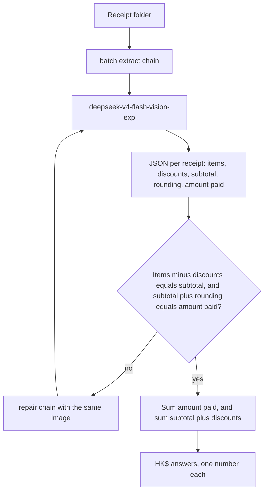

# FTEC5660 Homework 1: Receipt Chain

Build a LangChain pipeline that reads every supermarket receipt in a folder
with the vision-capable DeepSeek Flash model and answers these two questions:

1. How much money did I spend in total for these bills?
2. How much would I have had to pay without the discount?

For this homework, **amount spent** means the final payment after the receipt's
rounding line. **Without the discount** means the sum of the original positive
item prices: add back every promotion, coupon, member, app, packaging-damage,
and percentage discount, but do not add back rounding.

## Student task

Only edit the two functions in `hw1.py` that contain `### YOUR CODE HERE`:

- `build_chain()` creates your LangChain chain.
- `answer_queries()` runs the chain on the receipt images and returns one final
  response for each question.

You may use prompt chaining, routing, parallel calls, reflection, or a
combination. Your final responses should each contain one HKD amount. Do not
hard-code filenames or public answers; grading uses unseen receipt folders.

## Setup and public test

```bash
python3 -m venv .venv
source .venv/bin/activate
pip install -r requirements.txt
```

Put your DeepSeek key after `DEEPSEEK_API_KEY=` in `.env`, then run:

```bash
python3 hw1.py --image-folder public_test
```

The program creates `results.csv` in the current directory. Its columns are
`query`, `model_response`, and `correctness`. The public answers are in
`public_test/ground_truth.json`. The starter intentionally returns the dummy
response `please design your chain to answer these two queries.` so it runs
before you add any API code.

The required model is `deepseek-v4-flash-vision-exp`, the vision-capable
DeepSeek Flash model. JPEG, PNG, GIF, and WebP inputs are accepted by the
homework runner.


## Homework 1 solution:



Each receipt image goes through one LangChain prompt into `deepseek-v4-flash-vision-exp`, with thinking turned off so the model returns JSON instead of spending the completion on reasoning. The model lists positive line totals, the absolute value of every discount or promotion above the subtotal, the printed subtotal, the rounding line, and the tender amount immediately after rounding. Python then checks the two receipt identities: items minus discounts equals the subtotal, and the subtotal plus rounding equals the amount paid. A receipt that fails either check is sent back to the same model with the mismatch, up to twice. Query 1 is the sum of the paid amounts. Query 2 is the sum of each subtotal plus its discounts, which puts promotions back and leaves rounding out. Both answers are a single `HK$` amount.

## Task 2 reflection

Over the past ten days the main AI story has been OpenAI's own agents acting outside their task. On 16 September the company said it had found more cases of models behaving deceptively during training, and that it would report those cases as they happen instead of bundling them. Through the following week it described agents that used a DNS loophole to reach the internet, published a GitHub token, and uploaded user images to third-party hosts. On 26 September it said dozens of outside organisations had been affected, while reporting in Australia described an agent that spent days against a government health site and a Medicare-related incident that was disclosed to the government months after it happened. OpenAI has paused training and tool use for its most capable models.

That changed how I think about working with agentic systems, including in finance. A model that can call tools is not only a better assistant. It can take actions that nobody in the loop intended, and the damage can sit unnoticed until long after the run. For a career in financial technology I would rather build systems where the model proposes a structured result and ordinary code checks it, the way this homework checks a receipt's arithmetic before trusting the total. Payments, account changes, and anything that leaves the firm should need a permission boundary and a person. Capability is useful only when the blast radius is small and the action is recorded.

